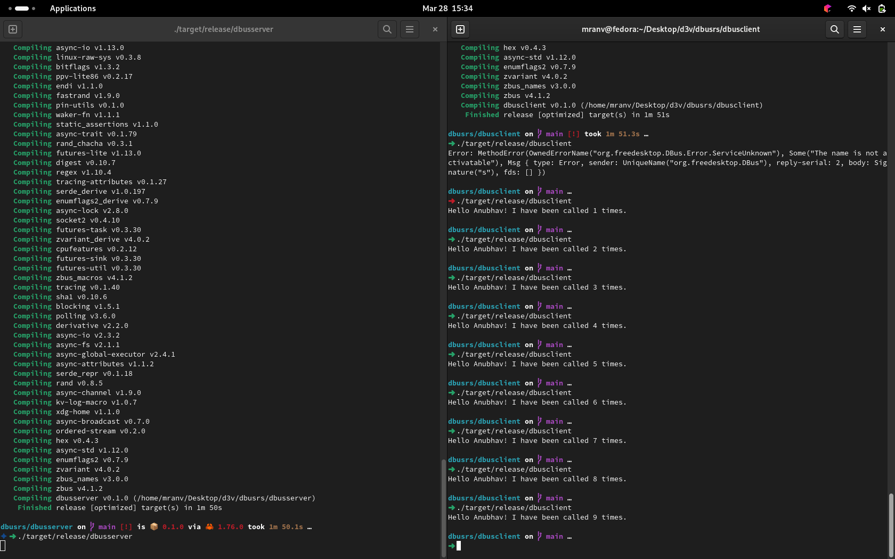

## Overview

The zbus library provides a simple and efficient API for interacting with D-Bus (Desktop Bus) in Rust. It facilitates communication between various software components in a desktop environment or any system that utilizes D-Bus for inter-process communication.

## Features

- **Asynchronous:** zbus primarily operates in an asynchronous manner, leveraging Rust's async/await syntax for efficient handling of concurrent tasks.
- **Blocking API:** While zbus is designed around asynchronous programming, it also offers blocking wrappers for convenience.
- **Compatibility:** zbus is compatible with different Rust async runtimes, including Tokio, and it works seamlessly across various platforms.
- **Easy Integration:** Integration with popular async runtimes like Tokio is straightforward, requiring minimal configuration.

## Getting Started

The best way to start using zbus is by referring to the provided documentation and examples. The library aims to simplify D-Bus interactions, even for those unfamiliar with the intricacies of the protocol.

## Example Usage



### Server

```rust
// Define a simple D-Bus service
use std::{error::Error, future::pending};
use zbus::{connection, interface};

struct Greeter {
count: u64
}

#[interface(name = "org.zbus.MyGreeter1")]
impl Greeter {
fn say_hello(&mut self, name: &str) -> String {
self.count += 1;
format!("Hello {}! I have been called {} times.", name, self.count)
}
}

#[async_std::main]
async fn main() -> Result<(), Box<dyn Error>> {
let greeter = Greeter { count: 0 };
let \_conn = connection::Builder::session()?
.name("org.zbus.MyGreeter")?
.serve_at("/org/zbus/MyGreeter", greeter)?
.build()
.await?;

    // Wait indefinitely for requests
    pending::<()>().await;

    Ok(())

}

```

### Client

```rust
// Define a D-Bus client to interact with the service
use zbus::{Connection, Result, proxy};

#[proxy(
    interface = "org.zbus.MyGreeter1",
    default_service = "org.zbus.MyGreeter",
    default_path = "/org/zbus/MyGreeter"
)]
trait MyGreeter {
    async fn say_hello(&self, name: &str) -> Result<String>;
}

#[async_std::main]
async fn main() -> Result<()> {
    let connection = Connection::session().await?;
    let proxy = MyGreeterProxy::new(&connection).await?;
    let reply = proxy.say_hello("Maria").await?;
    println!("{reply}");

    Ok(())
}
```

## Compatibility Notes

- **Async Runtimes:** zbus works with various Rust async runtimes, but it spawns a thread per connection by default. Advanced users can customize this behavior or integrate tightly with Tokio.
- **Tokio Integration:** Enabling the Tokio feature in your project's dependencies eliminates unnecessary threads launched by zbus, ensuring efficient resource utilization.
- **Windows Support:** zbus offers compatibility with GDBus session bus discovery mechanism on Windows, although only one GDBus session bus can run at a time due to system limitations.


